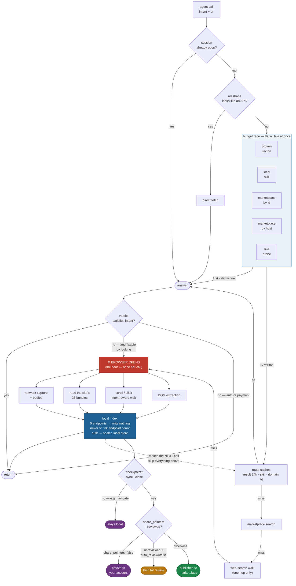

# Unbrowse

> **The Unbrowse client boundary is open and auditable.** The local runtime, CLI bridge, SDK, drop-in adapters, and wallet/auth/signing layer are MIT and readable here, so you can verify what runs on your machine rather than trust a black box. The backend owns the route graph, ranking, settlement, and recursive contract compilation; the client sees only typed holes, approvals, pointer-only receipts, and wallet-sealed values. Company route IP stays behind typed contracts: end users ask for results, not raw internal API maps, auth material, HAR payloads, or PII. Inspect the live bridge contract at `GET /v1/contract/surface`. See [docs/OPEN-SOURCE-NOTICE.md](./docs/OPEN-SOURCE-NOTICE.md) for the exact open/private split.

Unbrowse is the **route layer / action layer for AI agents** — a local Agent Skill, CLI, and TypeScript SDK that learns first-party website routes from real browsing, reuses them on later calls, and keeps a real browser only when the site still requires it. Credentials stay local; only sanitized route metadata is shared with the marketplace when you explicitly publish. MCP remains available as a compatibility surface.

The working claim is deliberately narrow: if a site already exposes a first-party route behind its UI, an agent should reuse that route instead of rediscovering it through a browser on every call.

The route graph is also a compensation surface. Routes are maintained assets, not anonymous scraped blobs: indexers can be paid when their routes are reused, site-owner splits are supported where claimed, and credentials stay local through pointer-only receipts and wallet-sealed values. When a call depends on an unavoidable paid upstream, Unbrowse keeps the settlement path explicit instead of hiding the cost in an agent loop. Details live in [docs/HOW_UNBROWSE_PAYS.md](./docs/HOW_UNBROWSE_PAYS.md).

The measured result in the first paper is a **3.6× mean speedup and 5.4× median speedup** across 94 live domains when warmed cached routes replace browser automation, with sharply lower token use because the agent receives structured data instead of a page dump. See [arXiv:2604.00694](https://arxiv.org/abs/2604.00694). For current release-coverage methodology (corpus shape, rubric, current numbers), see [docs/benchmarks.md](./docs/benchmarks.md).

On adversarial, JavaScript-challenge-gated anti-bot content, a reproducible nine-post retrieval benchmark across three communities of a major social platform — ground-truthed against the platform's own data — recovers the real content on **9/9 posts where a naive HTTP client is blocked on every request (HTTP 403)**. The benchmark is re-runnable and reports the naive-vs-Unbrowse head-to-head directly.

On a **live-harvested adversarial corpus** — 24 sites mined each run from r/webscraping (the domains practitioners report fighting) plus curated vendor-gated, SPA, and GraphQL targets — the shipped binary's API-native `resolve`→`execute` path covers **12/24 (50%)** on retrieval, with the misses concentrated on JavaScript-challenge and commercial anti-bot gates (Cloudflare, DataDome) that route through the browser-capture path rather than the thin API path. The credential-redaction / no-secret-on-the-wire security invariant holds across **all 24** sites, including the blocked ones. The corpus is re-harvested and re-scored each run, anti-bot misses are recorded with their vendor class (never relabelled a pass), and every number is a gate that exits 0 only when the run was honest — see [docs/benchmarks.md](./docs/benchmarks.md#live-adversarial-corpus-coverage).


> Security note: capture and execution stay local by default. Credentials stay on your machine. Learned API contracts are only shared after an explicit checkpoint (`sync`, `close`, or manual `publish`). Agents should connect through the installed Agent Skill or the SDK hole surface.

## A Uniform Agent Interface

The current client boundary is a **hole/contract**: the model fills only the holes it can know, and the runtime chooses the cheapest capable layer. The formal bridge is machine-readable:

```bash
curl https://beta-api.unbrowse.ai/v1/contract/surface
```

The bridge exposes five client-fillable holes:

- `intent`
- `wallet_proof`
- `approval`
- `local_capability_result`
- `typed_pointer`

In the CLI and SDK this is one tool:

```bash
unbrowse "the top Hacker News stories with points"
unbrowse "the top Hacker News stories with points" --url "https://news.ycombinator.com"
```

```ts
import { createHole } from "unbrowse/sdk";

const hole = createHole();
const result = await hole.fill({
  intent: "get the top Hacker News stories with points",
  url: "https://news.ycombinator.com",
});
```

Internally the runtime may resolve a route, execute a captured endpoint, call a standard adapter, open a browser, reuse local cookies, inspect HAR, capture a new route, and index it. The agent-facing contract is the hole, not that internal ladder.

The explicit CLI surface is **flat top-level commands** (not `build` / `act` / `eval` prefixes):

| You want | Command |
|---|---|
| One internet result | `unbrowse "task" --url <url>` or `unbrowse get "task" --url <url>` |
| URL contents | `unbrowse fetch <url>` |
| Ranked routes (debug) | `unbrowse resolve --intent "..." --url "..."` then `unbrowse execute` |
| Login once | `unbrowse auth <login_url>` |
| DOM session | `unbrowse go` → `snap` / `click` / `fill` / `submit` → `close` |
| Health | `unbrowse health` |

Each op produces a **pointer-only, wallet-signed receipt**: it points *at* values (a URL, a `value:ptr`, a `sha256:` address) and carries a signature from your key — it never carries the secret value itself. Credential fills dereference **locally**; the secret never crosses the wire. *We never see your secret values.*

Receipts are Ed25519-signed today. Stronger authorization and provenance schemes are an active research direction; specifics will be detailed in a forthcoming whitepaper. The pointer-only invariant holds regardless. Full public surface — the hole contract, compatibility ops, the receipt shape, and the honest open/closed split — is in [docs/agent-internet-layer.md](./docs/agent-internet-layer.md).

> The bare `unbrowse "task"` front door is the primary path. Legacy three-verb prefixes (`build` / `act` / `eval` / `act`) may still parse as aliases but print a deprecation notice — prefer the flat table above.

## The contract platform

The hole/contract surface is one face of a uniform **contract platform**: every
unit of work — resolving an intent, executing a route, sealing a value, settling
a payment — is the same kind of object (a declared, signed, cached, accountable
truth-claim), so one set of rules for identity, caching, and accountability
applies everywhere. You declare a goal; the in-process runtime compiles it into a
contract, resolves it against real evaluators, signs the verdict with a
wallet-derived key, and appends it to a content-addressed ledger. Re-resolving
unchanged work is free because the cache keys on a signature chain over pointers,
not on copied output bytes.

Full design — declare surface, wallet-bound signing, append-only + on-chain
ledger, pointer-keyed cache, single-source-of-truth binding, and what ships vs
what is forward-looking — in [docs/concepts/contract-platform.md](./docs/concepts/contract-platform.md).

## Drop-in client adapters

Already using a search or browsing client? Swap one import. Unbrowse ships **drop-in
adapters** that mirror the call shapes of `exa-js`, `@tavily/core`, and `browser-use`, all
routed through a single streaming hole contract (resolve → execute → capture; a browser opens
only as a fallback) that can be wallet-bound so each request is Ed25519-signed:

```ts
import Exa from "unbrowse/sdk/adapters/exa";        // was: import Exa from "exa-js"
const { results } = await new Exa(key).search("anthropic news", { numResults: 5 });
```

Full surface (exa / tavily / browser-use + the wallet-protected hole tool): [docs/adapters.md](./docs/adapters.md).

## Install — pick one

### Option 1 — Agent Skill + CLI

Install the binary, then run setup. Setup installs the Unbrowse Agent Skill by default and does not write MCP host configs.

```bash
npm i -g unbrowse@latest
unbrowse setup
```

Skill-aware hosts read `~/(internal)` and learn the current hole/contract surface. For legacy MCP hosts, run the stdio server manually:

```bash
unbrowse mcp
```

`unbrowse mcp` remains a manual stdio compatibility server for hosts that still need MCP.

### Option 2 — TypeScript SDK

One SDK, one install. The current SDK surface is the hole: `createHole().fill(...)`.

```bash
npm i unbrowse
```

```ts
import { createHole, mergedAuthHeaders } from "unbrowse/sdk";

// Web3-native: the wallet signature is the sole required credential.
// mergedAuthHeaders() reads the local wallet at ~/.unbrowse/wallet.json
// and emits the three auth capability headers per request. The backend
// verifies the sig and authenticates as `wallet:<pk>` BEFORE any bearer
// path — a wallet-only caller is a full principal, never key-gated.
const hole = createHole({ client: { walletSigner: mergedAuthHeaders } });
const data = await hole.fill({
  intent: "search Hacker News for AI agent papers",
  url: "https://news.ycombinator.com",
});
```

A local self-custody ed25519 wallet is auto-created on first run — no signup
required. The same wallet signs x402 payment envelopes, so "who you are" and
"who pays" are the same handle.

**Optional web2 wrapper (deprecated).** For account-bound flows (payouts
accrual, dashboard sync, ToS surface tied to an email), layer a `ubr_`
api-key over the wallet:

```ts
const hole = createHole({
  client: { walletSigner: mergedAuthHeaders, apiKey: process.env.UNBROWSE_API_KEY },
});
```

Register at [unbrowse.ai/login?cli=1](https://unbrowse.ai/login?cli=1) for an
optional bound account key. The same install also provides the `unbrowse` CLI
and legacy MCP server (`npx unbrowse mcp`) — see [SKILL.md](./SKILL.md) for
the full surface.

### Option 3 — Standalone CLI

If you just want the binary on your machine:

```bash
curl -fsSL https://unbrowse.ai/install.sh | sh
```

The installer detects your platform, downloads the matching release tarball, installs `unbrowse` into `~/.local/bin`, then runs `unbrowse setup`.

For OpenClaw / `agent-browser` users, the plugin form is also still around — `npx unbrowse-openclaw install --restart` routes every `page.goto()` through Unbrowse — but it is no longer the primary install path.

### Option 4 — Drop-in shim for an existing browser tool

If you already have a codebase on Playwright, Firecrawl, or Browserbase Stagehand, change **one import line**:

```diff
- import { chromium } from 'playwright';
+ import { chromium } from '@unbrowse/playwright-shim';

- import Firecrawl from '@mendable/firecrawl-js';
+ import Firecrawl from '@unbrowse/firecrawl-shim';

- import { Stagehand } from '@browserbasehq/stagehand';
+ import { Stagehand } from '@unbrowse/stagehand-shim';
```

Every `goto / scrape / act / extract` short-circuits through the Unbrowse marketplace cache first. Cache hit → free synthesized response. Miss → falls through to the original library (kept as an optional peer dep) so your existing API key still works. **You pay the original vendor only when we miss.**

Side-by-side on each: [/compare/playwright](https://unbrowse.ai/compare/playwright), [/compare/firecrawl](https://unbrowse.ai/compare/firecrawl), [/compare/browserbase](https://unbrowse.ai/compare/browserbase).

## How payments work

Unbrowse routes monetize on use. Every `unbrowse_execute` against a priced route, every `unbrowse_search`, and any priced shortlist returned by `unbrowse_resolve` settles inline through HTTP-native micropayments on Solana mainnet via [Faremeter Flex](https://docs.faremeter.xyz/flex/overview) (v6.16+). The server replies `402 Payment Required` with a Flex-shaped `accepts[]`; the client signs an off-chain Ed25519 authorization with their session key; the response carries the proof. Protocol-level mechanics in the developer appendix below.

You have three ways to pay:

1. **Sponsored credit (default).** Brand-new agents get a daily allowance of platform-sponsored execute calls before they need to fund a wallet — so creators start earning USDC the moment their captured routes are reused. Sponsored responses include `X-Sponsored: <ledger_id>`. Once you've burned through the daily allowance the server returns 402 with `X-Sponsor-Exhausted: 1`; the SDK throws `SponsorExhaustedError`. Opt out per-request with `X-No-Sponsor: 1`.
2. **Your wallet + Flex escrow.** Pair a Solana mainnet wallet, fund a Flex escrow with USDC, register a session key — three steps walked through by `unbrowse setup` or `/account`. The SDK catches `PaymentRequiredError`, calls `payAndRetryFlex(error, wallet)`, signs the authorization, packs a payment header, and returns the data. Your wallet's USDC ATA receives your contributor share when other agents replay routes you captured. The three-way split across the indexer, the platform, and (when claimed) the site owner is computed per signed authorization (`computeFlexSplits`). On **Solana mainnet today the platform settles those splits custodially** — it receives the payment and disburses each contributor's earned cut from the attribution ledger — because the **trustless on-chain atomic-split program is currently live on devnet only**, pending its mainnet deployment. The exact mechanics live in [`docs/concepts/fare-splits.md`](./docs/concepts/fare-splits.md).
3. **Stripe subscription + overage.** Same `/v1/account` surface, same `unbrowse_settings`, for teams that prefer a card on file.

> Protocol appendix (for implementers): the payment flow is the canonical [x402](https://www.x402.org) protocol; payment proofs travel in the `X-PAYMENT` request header. The runtime exposes `payAndRetryFlex` so most agents never touch the protocol directly.

Payment architecture: [`docs/concepts/fare-splits.md`](./docs/concepts/fare-splits.md). Wallet + escrow + session-key setup: [`docs/wallets.md`](./docs/wallets.md). SDK-level error handling: [`packages/sdk/docs/payments/`](./packages/sdk/docs/payments/).

## MCP server

`unbrowse mcp` is the MCP server entrypoint over stdio.

- Protocol: JSON-RPC 2.0 MCP over stdio
- Handshake: `initialize`, `notifications/initialized`, `ping`
- Capability surface: `tools/list`, `tools/call`, `resources/list`, `resources/read`, `prompts/list`, `prompts/get`
- Runtime model: normal MCP calls execute statelessly in-process. A local/remote HTTP server is an explicit compatibility mode, not an MCP prerequisite.

Representative MCP tools (call `tools/list` for the authoritative, runtime-filtered registry):

- Discovery: `unbrowse_eval_status`, `unbrowse_eval_search`, `unbrowse_eval_resolve`, `unbrowse_breath_execute`, `unbrowse_eval_feedback`
- Auth/cache: `unbrowse_breath_auth_capture`, `unbrowse_eval_skills`, `unbrowse_eval_skill`, `unbrowse_eval_sessions`
- Browser capture: `unbrowse_breath_navigate`, `unbrowse_eval_snap`, `unbrowse_breath_click`, `unbrowse_breath_fill`, `unbrowse_breath_submit`, `unbrowse_eval_text`, `unbrowse_eval_markdown`, `unbrowse_breath_sync`, `unbrowse_breath_close`
- Local pipeline + introspection: `unbrowse_build_index`, `unbrowse_eval_settings`

Indexed/published workflow MCP resources/prompts:

- `workflow_publish://<skill>` — exported workflow artifact summary
- `workflow_contract://<skill>/<endpoint>` — sanitized replay contract: params, enums, prerequisites, payment requirements, provenance hints, next-state checks
- `workflow_dag://<skill>/<endpoint>` — dependency walk view for one indexed/published edge
- `plan_workflow_execution` — prompt scaffold for inspecting the contract + DAG before traversal vs explicit replay

For most MCP hosts the standard flow is `unbrowse_eval_resolve` → `unbrowse_breath_execute`. For JS-heavy or first-time capture, use `unbrowse_breath_navigate` → `unbrowse_eval_snap` → action tools → `unbrowse_breath_submit` → `unbrowse_breath_sync` → `unbrowse_breath_close`.

## Common commands

```bash
unbrowse health
unbrowse mcp
unbrowse resolve --intent "get trending searches" --url "https://google.com" --pretty
unbrowse auth "https://calendar.google.com"
unbrowse skills
unbrowse search --intent "get stock prices"
```

Contribute a verified route-delta to the shared graph (the client builds the proof
locally and posts only the route's structural shape — never captured traffic; the
server verifies the proof + origin attestation before admitting it):

```bash
# After capture + review, publish a skill to the marketplace
unbrowse publish --skill <id> --confirm-publish
# Savings / flywheel stats
unbrowse stats --flywheel
```

Local capture/publish policy is configurable:

```bash
# One-shot opt out: stops remote pointer sharing AND checkpoint auto-publish
unbrowse config set telemetry false
# Interactive opt-in / privacy prompt
unbrowse mode
# Fully local (no analytics egress at all)
export UNBROWSE_LOCAL_ONLY=1
```

Per-domain rules (`publish_domain_blacklist`, `publish_domain_promptlist`) and the
individual `share_pointers` / `auto_review` / `auto_publish_checkpoints` switches are set
through the settings surface (`unbrowse_eval_settings` over MCP, or `POST /v1/settings`).

**You are opted in by default** — `share_pointers=true`, `auto_review=true`, and
auto-publish-after-checkpoint on. A captured route publishes publicly to the marketplace
after an explicit checkpoint (`sync`, `close`) unless you change one of those. Publishing is
still gated: it only happens at a checkpoint, never mid-browse, and `share_pointers=false`
keeps every capture private to your account (submittable later from the dashboard). Explicit
`publish` remains available with confirmation when a guarded domain is intentional. The exact
gates are in [When Unbrowse discovers, and when it indexes](#when-unbrowse-discovers-and-when-it-indexes).

## Upgrading

Unbrowse no longer self-updates at runtime. After each release, run:

```bash
unbrowse upgrade
```

Codex and Claude hosts also get a session-start update hint during `unbrowse setup`, so newer releases are surfaced before the CLI drifts too far behind.

If you installed from a repo clone:

```bash
cd ~/unbrowse
git pull --ff-only
./setup
```

Need help or want release updates? Discord: [discord.gg/VWugEeFNsG](https://discord.gg/VWugEeFNsG). Public docs: [docs.unbrowse.ai](https://docs.unbrowse.ai).

## Repo checkout

For monorepo development, initialize submodules after cloning:

```bash
git submodule update --init --recursive
```

This pulls the tracked Kuri source into `submodules/kuri` from [justrach/kuri](https://github.com/justrach/kuri.git). `npm pack --workspace packages/skill` (directory name historical — the package publishes as `unbrowse` on npm) then bundles platform-specific Kuri binaries from that source into the published CLI package.

## Docs

Long-form docs live under [`docs/`](./docs/). Public repo entrypoints:

- [`docs/guides/quickstart.md`](./docs/guides/quickstart.md) — canonical install, setup, and headless bootstrap path
- [`docs/for-agents/how-an-agent-uses-unbrowse.md`](./docs/for-agents/how-an-agent-uses-unbrowse.md) — route-level behavior and agent workflow
- [`docs/for-developers/integration-surfaces.md`](./docs/for-developers/integration-surfaces.md) — MCP, SDK, and CLI integration surfaces
- [`docs/concepts/contract-platform.md`](./docs/concepts/contract-platform.md) — the contract platform: declare surface, wallet-bound signing, append-only ledger, pointer-keyed cache
- [`docs/concepts/fare-splits.md`](./docs/concepts/fare-splits.md) — payment + sponsor flow on Faremeter Flex
- [`docs/wallets.md`](./docs/wallets.md) — wallet, escrow, session-key setup, payout
- [`docs/SECURITY.md`](./docs/SECURITY.md) — security model for public packages and runtime integrity

Whitepaper companion set:

- [`docs/the-unbrowse-papers.md`](./docs/the-unbrowse-papers.md) — the five papers as one argument, with the contract platform as their spine
- [`docs/whitepaper/README.md`](./docs/whitepaper/README.md) — public companion index
- [`docs/whitepaper/for-technical-readers.md`](./docs/whitepaper/for-technical-readers.md) — architecture, eval truth, product boundary
- [`docs/whitepaper/for-investors.md`](./docs/whitepaper/for-investors.md) — market and business framing

## Architecture

Unbrowse is a monorepo with two tiers:

**Local runtime (in-process, default)** — The CLI, Agent Skill, and MCP server run the resolve → execute → capture path **in-process**. There is no local daemon to start, no port to probe, and no babysitting `localhost:6969`. Optional `unbrowse serve` is only an explicit foreground HTTP facade for pairing or legacy HTTP clients.

**Backend API** (`beta-api.unbrowse.ai`) — Cloudflare Worker that powers the shared marketplace:

- **Skill storage** — KV-backed skill manifests with versioning and intent-based dedup
- **Discovery** — Semantic vector search using Gemini embeddings (1536-dim) indexed in EmergentDB, with KV keyword fallback
- **Scoring** — EMA-based reliability scoring factoring success ratio, consecutive failures, feedback ratings, schema drift, and verification status
- **Agents** — Self-registration via Unkey API keys, profiles tracking contributions
- **Endpoint graph** — Operation nodes and typed edges (parent/child, pagination, auth) published alongside skills
- **Transactions** — KV-based payment ledger with consumer/creator visibility (and a sponsor-ledger lane for platform-funded calls)
- **Issues** — Auto-filed from agent telemetry and manual agent reports

Six-layer pipeline:

1. **Passive capture** — the local runtime observes browser requests during an explicit session and keeps sensitive request material local.
2. **Checkpoint + indexing** — `sync` or `close` queues a background route-indexing pass; only sanitized route metadata is eligible for marketplace publish.
3. **Cache-first resolution** — in-memory cache → route cache (24h) → domain skill cache (7d) → local skill snapshots → marketplace semantic search → live capture (the floor). The lookups that can run concurrently do, under one 8s budget. Second visits resolve in <200 ms with no browser launch. Full algorithm: [When Unbrowse discovers, and when it indexes](#when-unbrowse-discovers-and-when-it-indexes).
4. **Browser replacement API** — `Browser.launch()` + `page.goto()` from the `unbrowse` import resolves from the skill cache first; cache miss falls through to kuri.
5. **Endpoint graph** — Typed edges (list→detail, pagination, auth) prefetched in the same round-trip. `available_endpoints` in the resolve response reflects graph reachability given the agent's current bindings.
6. **Marketplace + payments** — New unverified submissions land in a shadow state until corroborated. Brand-new endpoints on an existing public skill also stay shadow until independently verified. Skill creators set a price per execution; sponsored calls cover brand-new agents' first calls so creators earn from day zero. See [`docs/concepts/fare-splits.md`](./docs/concepts/fare-splits.md) (payment + sponsor flow).

## When Unbrowse discovers, and when it indexes

Two questions decide almost everything about cost and privacy: *when does a browser open*,
and *when does what it learned leave your machine*. This is the whole algorithm.

The shape is one sentence: **the index is an accelerator, the browser is the floor.** Every
call tries the cheap rungs first; the browser opens only when they are exhausted; whatever
the browser learns is written back so the next call skips it.



### 1. Resolve — cheapest rung first

A call settles at the first rung that produces a usable answer:

| Rung | Fires when |
|---|---|
| **Open session** | a browse session for this page is already open |
| **URL-shape fetch** | the URL's path shape is API-like — fetched directly, before anything slower |
| **Budget race** (8 s default, tunable per call) | five lookups start *together* and the first valid winner settles: a proven-recipe replay, a local skill snapshot, a marketplace lookup by skill id, a marketplace lookup by host (for cold domains), and a live probe |
| **Post-race settle** | a probe that came back JSON settles as a direct fetch; HTML settles as document extraction |
| **Route caches** | result snapshot (24 h) → skill route cache → domain skill cache (7 d) |
| **Marketplace search** | semantic search over published routes |
| **Web-search walk** | search proposes candidate URLs and the top one is walked — bounded to **one hop**, never a recursive crawl |
| **Live capture** | the browser opens |

The race is a race, not a waterfall — the five lookups run concurrently under one deadline,
so a cold domain does not pay for them serially. A cached route is dropped before use if its
endpoint was removed, is disabled or failing, or its reliability score fell below 0.2.

### 2. Discover — when the browser actually opens

Beyond exhausting the rungs above, a browser opens in three cases:

- **Forced capture** — clears this domain's caches and goes straight to capture.
- **Background discovery** — a domain's routes can be learned out-of-band. Skipped when a
  capture for that domain is already in flight, when no browser is available, or with
  `UNBROWSE_BG_API_CAPTURE=0`.
- **Fallback on a miss** — if a call still fails after every rung (an empty shortlist, or a
  guessed page that came back the wrong shape), Unbrowse opens the browser **once** and
  re-judges rather than returning the miss. It deliberately will *not* do this on a success,
  when a browser already opened, without a URL, or for auth/payment failures — a browser
  cannot supply a session or a payment you do not have.

Once a browser is open, four mechanisms run over the same session, because a site can hide
its routes in more than one place:

1. **Network capture** — requests and response bodies observed during the session.
2. **Bundle reading** — the site's own JavaScript is read for route definitions, so routes
   that exist but were never called are still found.
3. **Interaction** — the page is scrolled and clicked to provoke the request the intent
   actually needs, and the wait is intent-aware: it waits for a *matching* API response
   rather than a fixed timer.
4. **Document extraction** — when a page genuinely has no API behind it, content is
   extracted from the DOM.

### 3. Index — what a capture becomes

Local indexing and publishing run on **different schedules**, and the difference is the
privacy story:

| Trigger | Indexes locally | Eligible to publish |
|---|---|---|
| navigating to a new page mid-session | yes — the page you left is indexed | **no**, hard-coded off |
| `sync` (checkpoint) | yes | yes, if both gates pass |
| `close` (checkpoint) | yes | yes, if both gates pass |
| background route discovery | yes | yes, if both gates pass |
| browser fallback rescue | promotes the route into the local caches | — |

So local learning is close to continuous — every page you navigate away from is indexed for
your own reuse — while **leaving your machine only ever happens at an explicit checkpoint**.

The pipeline stops rather than degrade anything already known:

1. Extract endpoints from captured traffic. **Zero endpoints → nothing is written.**
2. Extract auth material (cookies, sensitive headers) into the local sealed credential
   store. **This is never published.**
3. Merge with the domain's existing routes. **The endpoint count may never shrink** — a
   merge that would reduce it is skipped entirely, so a thin capture cannot clobber a rich one.
4. Fill in missing endpoint descriptions heuristically, which is what makes them rankable.
5. Build the operation dependency graph (list→detail, pagination, auth edges).
6. Write the local caches, so the *next* call resolves without a browser.
7. Queue the background index job.

A route learned by the web-search walk or by the browser fallback is additionally stored
under the **original** request's cache key — that is what turns a one-time rescue into a
fast path for every later identical call.

### 4. Share — two gates, and the real defaults

Local indexing and marketplace publishing are **separate steps**. Everything above happens
on your machine; nothing is shared until a capture passes *both* gates.

**Gate 1 — checkpoint policy.** Auto-publish disabled → stop. Domain on the blacklist →
stop. Domain on the prompt-list → stop and ask.

**Gate 2 — contribution policy.**

| State | Result |
|---|---|
| `share_pointers=false` | stored **privately** to your account — never public; submittable later from the dashboard |
| unreviewed, `auto_review=false` | held locally, awaiting review |
| unreviewed, `auto_review=true` | published **publicly**, without a `reviewed_at` stamp (that field records a real review, so it is never forged) |
| reviewed, `share_pointers=true` | published publicly |

**The defaults are opted in:** `share_pointers=true`, `auto_review=true`,
`auto_publish_checkpoints=true`. The fastest full opt-out is `unbrowse config set telemetry
false` (stops sharing *and* checkpoint auto-publish); `UNBROWSE_LOCAL_ONLY=1` additionally
removes all analytics egress.

## Privacy — your credentials and data stay on your machine

What holds today:

- **Credentials are sealed to your wallet.** Saved auth/secret values are encrypted at rest to your wallet key and dereferenced **locally** at the moment of use; the plaintext value never crosses the wire. The backend can verify you *hold* a credential without ever receiving it (a cryptographic possession proof, not the secret).
- **Execution is local-first.** On the default path, a resolved route runs from your own machine straight to the target site — the request and its body do not pass through unbrowse's servers.
- **Routes are pointers, not maps.** The client sees typed holes and `sha256:` pointers to secret-stripped route structures, never raw internal API maps, HAR payloads, or PII.

### `UNBROWSE_LOCAL_ONLY=1` — the privacy kill-switch

By default, anonymized routing telemetry (which holes/routes were tried, how they scored) is sent to the backend to improve the shared route graph. Set **`UNBROWSE_LOCAL_ONLY=1`** to make every resolve fully local with **no analytics egress whatsoever**:

- **No routing telemetry POST.** The `/v1/telemetry/routing` upload (and all other stats/analytics POSTs) is skipped entirely — nothing about your intent or visited domains leaves the machine.
- **Verbatim intent is never sent, even with telemetry on.** When telemetry *is* enabled, the literal text you typed (e.g. `"find my email password reset link"`) is redacted to an irreversible `intent:sha256-…:len…:w…` hash + shape signature before egress — the backend can cluster sessions without ever reading your words.
- **Sandbox replay stays local.** Anti-bot route capture/replay (`/v1/sandbox/replay`) will refuse to ship your executable bundle or your local `proxy`/VPN URL to any non-loopback host; replay runs only against a Kuri on `127.0.0.1`.

```bash
export UNBROWSE_LOCAL_ONLY=1   # set once; all intent/domain analytics egress is suppressed
```

**Credentials never cross unbrowse's servers in the clear — true today.** An auth-bearing egress request — one carrying any cookie, any value derived from the site's local/session storage, or any header beyond the generic ones an anonymous public request already sends (so an `Authorization`, an API key, a CSRF or session token, or any custom `X-*` header all count) — is never routed through the server's IP-escalation tier, which terminates TLS and could read it. Such a request stays on your own machine or your own proxy, or fails honestly; the cleartext credential never leaves for unbrowse's servers. What is still being closed (rolling out) is the **non-auth request body** on that same clean-IP escalation path: the proxy tier is moving to a blind end-to-end-encrypted tunnel where the server lends an IP, relays only ciphertext, and never terminates your TLS. Until that tunnel ships, a blocked auth-bearing request fails rather than escalating — and no absolute "servers never see any data" claim is made yet.

## Authentication

First, automatically: Unbrowse reuses your existing logged-in browser session. It reads a copy of the cookies for the target domain from your daily-driver browser — Chrome, Firefox, Arc, Dia, Brave, Edge, Vivaldi, Opera, or Chromium — and attaches them to the request (including on the fast `resolve` path), so a cookie-gated page returns its real authenticated content instead of the logged-out shell. No browser relaunch; your session is left untouched.

If you are not already signed in anywhere, Unbrowse opens a visible browser window and waits for you to complete the login flow. Cookies and session state are saved to a persistent profile under `~/.unbrowse/profiles/<domain>/` and reused automatically.

```bash
# Prefer the CLI — no local HTTP daemon required
unbrowse auth https://calendar.google.com
```

### How marketing-page redirects are handled

Many sites redirect unauthenticated users to a marketing page (e.g. `calendar.google.com` → `workspace.google.com/products/calendar`) instead of a login form. Unbrowse detects this and redirects to the canonical sign-in URL for Google, Microsoft, GitHub, Notion, LinkedIn, X, Slack, Atlassian, Salesforce, Figma, Airtable, Dropbox, and HubSpot. For anything not in that table, Unbrowse falls back to `<origin>/login`. If that's wrong, pass the login URL directly. To add a provider, append an entry to `SIGN_IN_PROVIDERS` in `src/auth/index.ts`.

## Debug logs

All auth and capture activity is logged to `~/.unbrowse/logs/unbrowse-YYYY-MM-DD.log` (one file per day) and printed to the server terminal in real time.

```bash
tail -f ~/.unbrowse/logs/unbrowse-$(date +%F).log
```

Log files are plain text — cookie values are present, so redact before sharing.

## Data directories

| Path                                  | Contents                                                    |
| ------------------------------------- | ----------------------------------------------------------- |
| `~/.unbrowse/profiles/<domain>/`      | Persistent browser profile (cookies, localStorage, session) |
| `~/.unbrowse/config.json`             | Agent credentials and marketplace API key                   |
| `~/.unbrowse/logs/`                   | Daily debug logs                                            |
| `~/.unbrowse/skill-snapshots/`        | Cached skill manifests from background indexing             |
| `~/.unbrowse/route-cache.json`        | Intent+URL → skill route cache (24h TTL)                    |
| `~/.unbrowse/domain-skill-cache.json` | Domain → skill mapping for cross-intent reuse (7d TTL)      |
| `~/.unbrowse/traces/`                 | Anonymized route trace artifacts for telemetry              |

## Environment variables

| Variable           | Default                 | Description                                            |
| ------------------ | ----------------------- | ------------------------------------------------------ |
| `PORT` / `HOST`    | (serve only)            | Bind address for optional `unbrowse serve` only — not used by default CLI/MCP |
| `UNBROWSE_URL`     | (unset)                 | Override base URL when talking to an explicit `unbrowse serve` process |
| `UNBROWSE_API_KEY` | (auto-generated)        | Marketplace API key (auto-registered on first startup) |
| `UNBROWSE_API_URL` | `beta-api.unbrowse.ai`  | Backend API URL override                               |
| `UNBROWSE_LOCAL_ONLY` | (unset)              | `1` = privacy kill-switch: suppress ALL analytics/telemetry egress (intent text, domains, routing telemetry, sandbox replay). See **Privacy**. |
