# Orchestrator Analysis — Why Live DOM Data Never Reaches The User

## The Core Problem

When `executeBrowserCapture` returns live DOM data (e.g. 10 crates.io packages), the orchestrator **discards it** and re-executes endpoints via `tryAutoExecute`. The original data is lost.

## The Flow (Mermaid)

```mermaid
flowchart TD
    START[User: 'search crates.io for rust'] --> FORCE{forceCapture?}

    FORCE -->|yes| SKIP_MKT[Skip marketplace]
    FORCE -->|no| MKT[Search marketplace]

    MKT --> MKT_FOUND{Viable skills found?}
    MKT_FOUND -->|yes| AUTO1[buildDeferralWithAutoExec on marketplace skill]
    MKT_FOUND -->|no| SKIP_MKT

    AUTO1 --> AUTO1_OK{tryAutoExecute succeeds?}
    AUTO1_OK -->|yes| RETURN_DATA1[✅ Return actual data]
    AUTO1_OK -->|no| FALLBACK{shouldFallbackToLiveCapture?}
    FALLBACK -->|yes| SKIP_MKT
    FALLBACK -->|no| RETURN_DEFER1[❌ Return deferred message]

    SKIP_MKT --> CAPTURE[captureSession runs in browser]

    CAPTURE --> CAP_RESULT[Returns: requests, html, live_dom_extraction]

    CAP_RESULT --> EXEC_SKILL[executeSkill - browser-capture type]

    EXEC_SKILL --> EXEC_BC[executeBrowserCapture]

    EXEC_BC --> EXTRACT_EP[extractEndpoints from captured requests]
    EXTRACT_EP --> CLEAN[Filter to cleanEndpoints]

    CLEAN --> BUILD_PAGE[buildPageArtifactCapture from HTML]
    BUILD_PAGE --> PAGE_OK{pageArtifact.endpoint exists?}

    PAGE_OK -->|no, but live_dom_extraction exists| LIVE_DOM[Create endpoint from live DOM data]
    PAGE_OK -->|yes| HAS_ENDPOINTS{cleanEndpoints.length > 0?}
    PAGE_OK -->|no, no live DOM| NO_EP[Return no_endpoints error]

    LIVE_DOM --> DOM_RETURN["Return {data, _extraction: {source: 'live-dom'}} + learned_skill"]

    HAS_ENDPOINTS -->|yes| BUILD_SKILL[Build learned skill with all endpoints]
    HAS_ENDPOINTS -->|no| DOM_FALLBACK[Use domArtifact as fallback]

    BUILD_SKILL --> RETURN_LEARNED["Return {learned_skill_id, endpoints_discovered} + learned_skill"]

    DOM_FALLBACK --> DOM_RETURN2["Return {data, _extraction} + learned_skill"]

    %% Back in orchestrator
    DOM_RETURN --> ORCH_CHECK
    RETURN_LEARNED --> ORCH_CHECK
    DOM_RETURN2 --> ORCH_CHECK

    ORCH_CHECK{Back in orchestrator: learned_skill exists?}

    ORCH_CHECK -->|no| DIRECT_RETURN[✅ Return result directly - line 3142]
    ORCH_CHECK -->|yes| DOM_CHECK{isDirectDomResult?}

    DOM_CHECK -->|"yes AND source='html-embedded' AND no better API"| DIRECT_RETURN2[✅ Return DOM data directly - line 3116]
    DOM_CHECK -->|"yes AND source='live-dom'"| BLOCKED["❌ BLOCKED: source check only matches 'html-embedded'"]
    DOM_CHECK -->|no| AUTO2[buildDeferralWithAutoExec on learned_skill]

    BLOCKED --> AUTO2

    AUTO2 --> AUTO2_TRY[tryAutoExecute RE-EXECUTES endpoints]
    AUTO2_TRY --> AUTO2_OK{Succeeds?}
    AUTO2_OK -->|yes| RETURN_DATA2[✅ Return actual data]
    AUTO2_OK -->|"no (bad quality, API error, etc.)"| RETURN_DEFER2[❌ Return 'Found N endpoints. Pick one.']

    style BLOCKED fill:#ff6666,color:white
    style RETURN_DEFER1 fill:#ff6666,color:white
    style RETURN_DEFER2 fill:#ff6666,color:white
    style RETURN_DATA1 fill:#66cc66,color:white
    style RETURN_DATA2 fill:#66cc66,color:white
    style DIRECT_RETURN fill:#66cc66,color:white
    style DIRECT_RETURN2 fill:#66cc66,color:white
```



## The Specific Blocker

**Line 3108-3113 in orchestrator/index.ts:**

```typescript
if (
  isDirectDomResult &&
  (
    (directExtractionSource === "html-embedded" && !hasBetterStructuredSearchEndpoint) ||
    !hasNonDomApiEndpoints
  )
)
```

This check allows direct return ONLY when:
- `directExtractionSource === "html-embedded"` — but our live DOM returns `"live-dom"`
- OR `!hasNonDomApiEndpoints` — but crates.io has `site_metadata` (a non-DOM API endpoint)

Both conditions fail for live DOM + any site with metadata endpoints. The data falls through to `buildDeferralWithAutoExec` at line 3221 which **discards the original result** and re-executes.

## The Re-Execution Problem

`buildDeferralWithAutoExec` (line 1894) calls `tryAutoExecute` (line 2054) which:

1. Ranks the learned skill's endpoints by BM25 + readiness bonuses
2. Tries up to 5 candidates
3. For each: resolves params → executes → assesses result
4. If assessment says "fail" (bad data quality, wrong shape) → tries next
5. If ALL fail → returns deferral message

For crates.io: it tries `site_metadata` → gets config data → assessment says "fail" (not search results) → tries DOM endpoint → re-fetches page → extraction quality is poor → assessment says "fail" → defers.

**The original live DOM data (10 good items) was discarded at the orchestrator level and never used.**

## The Fix

**One line change at line 3108:**

```typescript
// BEFORE:
(directExtractionSource === "html-embedded" && !hasBetterStructuredSearchEndpoint)

// AFTER:
((directExtractionSource === "html-embedded" || directExtractionSource === "live-dom") && !hasBetterStructuredSearchEndpoint)
```

This allows live DOM results to bypass the deferral path, same as html-embedded results.

**BUT** there's a second gate: `!hasNonDomApiEndpoints`. When site_metadata exists, `hasNonDomApiEndpoints` is true. The fix:

```typescript
// BEFORE:
!hasNonDomApiEndpoints

// AFTER: also check if non-DOM endpoints are meaningful for the intent
!hasNonDomApiEndpoints || !hasIntentRelevantNonDomEndpoint
```

Where `hasIntentRelevantNonDomEndpoint` checks if any non-DOM API endpoint's URL matches the intent (not just exists).

## Why My Previous Patches Failed

I kept patching ONE condition at a time:
1. Added `"live-dom"` to source check → but `hasNonDomApiEndpoints` still blocked
2. Removed `learned_skill` from return → but orchestrator sets it from merged skill
3. Changed `hasMeaningfulEndpoint` → but `isSupportEvidenceEndpoint` matched site_metadata
4. Changed intent matching → but auto-generated descriptions had false positives

Each patch fixed one gate but the next gate caught it. The correct fix needs to address BOTH conditions in the single check at line 3108.

## 21 Return Paths in resolveAndExecute

```
MARKETPLACE PATH (9 returns):
  1. Route result cache hit → cached data ✅
  2. Route cache + autoexec → data or defer
  3. Domain cache + autoexec → data or defer
  4. Local snapshot + autoexec → data or defer
  5. Agent chose + route cache → execute directly ✅
  6. Local snapshot default + autoexec → data or defer
  7. No context URL → error thrown
  8. Agent chose + marketplace race → first success ✅
  9. Marketplace search + autoexec → data or defer

LIVE-CAPTURE PATH (12 returns):
  10. Domain cache + agent chose → execute directly ✅
  11. Domain cache + autoexec → data or defer
  12. In-flight wait → failed, no skill → error
  13. In-flight wait → skill learned → autoexec
  14. In-flight wait → success, no skill → raw result
  15. Learned skill irrelevant → error with endpoints
  16. No skill, failed → error/auth
  17. Direct DOM result + learned skill → data ✅ (ONLY if source='html-embedded')
  18. Direct DOM result, no skill → data ✅
  19. No skill, success → raw result
  20. Agent chose + learned skill → execute directly ✅
  21. Learned skill exists → autoexec or defer ← THIS IS WHERE WE END UP
```

## 12 Return Paths in executeBrowserCapture

```
  1-5: Auth errors (cloudflare, login redirect, auth wall)
  6: Bundle-only routes, no evidence → no_endpoints
  7: cleanEndpoints=0, DOM artifact exists → data + learned_skill ✅
  8: cleanEndpoints=0, quality gate rejected → low_quality error
  9: cleanEndpoints=0, no DOM → no_endpoints
  10: cleanEndpoints>0, html-embedded → data + learned_skill ✅
  11: cleanEndpoints>0, live DOM fallback → data + learned_skill ✅
  12: cleanEndpoints>0, default → {learned_skill_id, endpoints_discovered} + learned_skill
```

For crates.io/lobste.rs: we hit return #12 (cleanEndpoints has site_metadata, Cheerio found a DOM endpoint). Back in orchestrator, `learned_skill` is set → hits return #21 → autoexec → fails → defers.

If Cheerio had NOT found a DOM endpoint AND live_dom_extraction existed, we'd hit return #7 or #11 → back in orchestrator with `_extraction` in result → hits return #17... but ONLY if source is `"html-embedded"`, not `"live-dom"`.
