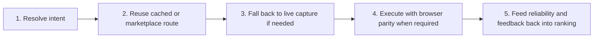

# How It Works

This page keeps the old explainer shape, but maps it to the actual system in the repo today.

## The Practical Loop

## 1. Resolve Intent

An agent starts with a task and a target URL or domain.

Unbrowse resolves that task against:

- local route and domain caches
- the shared marketplace
- live capture if reuse fails

This is not a pure embedding lookup. Current ranking also uses reliability, freshness, and verification state.

## 2. Reuse The Best Existing Route

If a good route already exists, Unbrowse executes it directly.

That is the fast path the product is optimized around.

In practice this can mean:

- server-fetch replay for straightforward routes
- DOM extraction on pages where structured replay is not the right move
- browser-context execution when auth or site behavior requires it

## 3. Learn Through Live Capture

If no viable route exists, Unbrowse launches the browser runtime and captures the site.

That capture flow can:

- observe real requests
- filter noise
- learn candidate endpoints
- seed local cache immediately
- publish reusable skill data back to the marketplace

This is the part of the system that turns individual usage into shared capability.

## 4. Execute With Browser Parity When Needed

The old docs were right to emphasize parity, but the implementation detail matters.

Unbrowse does not always need a browser at execution time.

It uses browser-context execution when the site depends on browser-bound state such as:

- cookies
- CSRF tokens
- redirect chains
- stricter authenticated SPA behavior

Otherwise, it prefers the cheaper and faster replay path.

## 5. Keep Good Routes Hot

The current repo has a practical quality loop:

- endpoint reliability scores
- verification status
- schema drift checks
- feedback after execution
- disabling or deprecating bad routes

This is simpler than the full validator economy described in the paper, but it is already a real operating loop.

## What Is Still Coming Soon

The old docs used language like:

- "publish a skill with verification proofs"
- "billing and payouts"
- "validator market"

Those need a grounded read today:

- practical verification exists
- formal attestation and validator economics do not
- billing and payouts do not

See [Paper vs Product Status](./paper-vs-product.md) and [Coming Soon](./coming-soon.md).

## Read Next

- [Key Concepts](./key-concepts.md)
- [System Today](./system-today.md)
- [Evaluation and Benchmarks](./evaluation.md)
