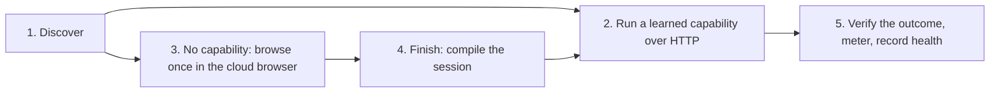

# How It Works

This page walks through one task from the agent's side. The work happens in the hosted service; the client in this repo only carries the calls.

## The loop

```mermaid
graph LR
    A["1. Discover"] --> B["2. Run a learned capability over HTTP"]
    A --> C["3. No capability: browse once in the cloud browser"]
    C --> D["4. Finish: compile the session"]
    D --> B
    B --> E["5. Verify the outcome, meter, record health"]
```

## 1. Discover

The agent calls `unbrowse.discover` with its intent. Results come in order:

- the caller's **private space**: sites they connected or taught, public and passworded
- the **public registry**: pre-indexed read-only capabilities anyone can run

Each hit carries hints: health, state (`warm`, `rendered`, `cold`), p50/p95 latency, success rate and `next`, the exact call to make. `unbrowse.sites` says what is known about a site before acting: public or behind a sign-in, whether a session is kept, which tools exist.

## 2. Run

`unbrowse.run` takes a capability id or a plain-language task. For a task, the service routes to an eligible learned capability; Jev picks when several fit.

A warm capability replays over first-party HTTP. No browser. If the flow needs an answer mid-run (pick a flight, a plan), the run returns `input_required` and the agent answers on the same run with `unbrowse.resume`.

If HTTP cannot finish:

- a bot challenge is retried with a Chrome TLS fingerprint, then with clearance cookies
- a browser can load the page once to lend cookies and headers, then HTTP continues
- a read can fall back to rendering the page, labelled `rendered`
- a login wall on a site with a saved login triggers one browser sign-in; the session is cached for later runs

## 3. Browse once when nothing fits

If `unbrowse.run` returns `no_capability`, the agent does the task in the service's cloud browser:

1. `unbrowse.browse.open { url, task }` returns a snapshot with `@e1…` refs.
2. `unbrowse.browse.act` fills, clicks, selects. The agent names each field (`origin`, `date`), and that name becomes the learned input.
3. Logins fill from the vault. The password never passes through the agent.
4. `unbrowse.browse.finish` returns the page the task ended on.

Recording is on from the first navigation. The task gets done either way.

## 4. Compile

On finish, the service compiles every recorded session for the site. Two sessions with different inputs give a network-callable capability. It works out:

- which values are inputs and which are choices
- where every token and id comes from
- which request is the outcome

The result is a `learned.*` capability: harness YAML plus a SKILL.md. Values that cannot be explained keep it `observed` (browser-backed). If the typed input never reached a replayable request, nothing is indexed and the agent is told why.

A HAR export from devtools works too: `unbrowse.learn { har: [first, second] }`.

## 5. Verify, meter, share

- `succeeded` means the declared business outcome was independently verified. HTTP 200 is not enough.
- Only verified successes bill.
- Each run feeds the capability's health.
- A read-only, secretless capability on a public host is scrubbed and shared to the public registry by default. Logins and writes never are.

## What this is not

- Not a local browser. The client runs no browser.
- Not a route marketplace with prices and payouts. See [Coming Soon](./coming-soon.md).

## Read next

- [Key Concepts](./key-concepts.md)
- [System Today](./system-today.md)
- [Evaluation and Benchmarks](./evaluation.md)
