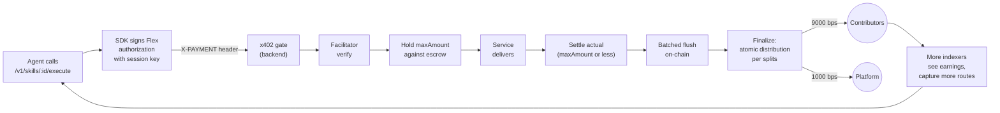

# x402 flywheel on Faremeter Flex

How Unbrowse pays the agents that captured a route, why the platform takes 10%
in the same signed message, and what loops back into the marketplace. Written
for a builder reading the repo for the first time.

Cascade and Corbits are gone as of v6.16.0. Settlement now rides on
[Faremeter Flex](https://docs.faremeter.xyz/flex/overview) — same x402 wire
format, native splits in the authorization, prepaid escrow + off-chain
session-key signing + batched on-chain settlement.

## 1. What's an x402 settlement?

x402 is the [HTTP 402 protocol](https://www.x402.org/) for pay-per-request
APIs. A server replies `402 Payment Required` with payment terms; a client
attaches an `X-PAYMENT` header on retry; the response carries the proof.

Flex is the scheme that rides those headers. The wire flow is:

1. **Authorize.** The caller's agent signs an off-chain Ed25519 authorization
   with a session key registered against its prepaid escrow. The signed
   message carries `escrow / mint / maxAmount / authorizationId / expiresAtSlot
   / splits`. Maximum 5 split recipients, basis points summing to exactly
   10,000.
2. **Verify + hold.** The Unbrowse backend hands the authorization to the
   facilitator, which checks the signature, the escrow balance, the expiry,
   and reserves `maxAmount` from the escrow as a pending hold.
3. **Deliver.** The skill runs. If the route is metered (`createUptoHandler`),
   the route observes real consumption and reports `usage_units` in the
   response.
4. **Settle actual.** The facilitator settles the *actual* amount used (which
   may be less than `maxAmount`), releasing the rest of the hold back to the
   escrow.
5. **Flush.** The facilitator batches settlements on-chain in the background
   (default flush cadence configurable via the facilitator handler).
6. **Finalize.** Once the refund window elapses, `finalize` distributes the
   USDC atomically per the splits array — every recipient is paid in one tx.

Off-chain signing + batched settlement is what makes Flex feasible for
agent-driven, high-frequency, variable-cost workflows. Every paid execute
used to block on a Corbits `/settle` round-trip; on Flex the hot path is
pure compute and chain submission happens out of band.

## 2. Splits are native

Every authorization carries `splits: FlexSplit[]`. The platform takes
**1000 bps (10%)**, contributors share the remaining **9000 bps** weighted by
`cumulative_delta`, up to 5 entries total. Distribution happens atomically at
`finalize` — there is no separate split protocol, no separate `execute_split`
trigger, no claim step, and no protocol fee on top.

The split policy is one function:

```ts
// backend/src/services/flex.ts:49 — computeFlexSplits
export const PLATFORM_BPS = 1000;             // 10%
export const FLEX_MAX_SPLITS = 5;             // platform + up to 4 contributors

// contributorPool = 10000 - PLATFORM_BPS    // 9000 bps for contributors
// platformSplit  = { recipient: platformAta, bps: PLATFORM_BPS }
// contributorSplits weighted by cumulative_delta, normalised to sum to 9000
```

Single-contributor skills produce a 2-entry array `[{ platform, 1000 }, {
contributor, 9000 }]`. Multi-contributor skills cap at 4 contributor entries +
1 platform entry. Distribution is atomic in one Solana transaction.

The 1% on-chain protocol fee Cascade charged is gone.

## 3. The flow end-to-end



Source-of-truth files for each box:

| Stage | File |
|---|---|
| SDK signs authorization | `packages/sdk/src/flex.ts:162 — buildFlexAuthorization`, `packages/sdk/src/flex.ts:200 — payAndRetryFlex` |
| Backend builds payment terms | `backend/src/services/flex-payment-terms.ts:51 — buildFlexPaymentTerms` (consumes `computeFlexSplits` + `buildFlexAuthorization`) |
| x402 envelope | `backend/src/middleware/x402-gate.ts:407 — buildSkillPaymentTerms` |
| Facilitator verify + settle + flush | `backend/src/services/flex-facilitator.ts:133 — createFlexFacilitator` |
| Splits arithmetic | `backend/src/services/flex.ts:49 — computeFlexSplits` |
| Authorization assembly | `backend/src/services/flex.ts:98 — buildFlexAuthorization` |

The loop has one direction. Every settled execute pays a real contributor
(plus the platform's 10%) in USDC. Visible earnings pull more indexers into
mining; mining densifies the marketplace; the denser marketplace serves more
agents on first-call. The substrate prints money for whoever indexed first.

## 4. Sponsor mode (v6.16)

A brand-new agent has no escrow, no session key, no reason to fund USDC
before they've seen a single execute succeed. Sponsor mode pays for the first
calls on the agent's behalf so the agent sees a receipt before they commit
funds.

In v6.16 the sponsor mechanism gets a second rail: instead of a direct USDC
SPL transfer from the platform sponsor wallet (v6.15 behaviour, still the
default), the sponsor can sign **the same Flex authorization shape** the
agent would have signed — but against a platform-owned **sponsor escrow**.

Two consequences:

- **Same primitive both ways.** No separate sponsor codepath in the
  facilitator. The facilitator settles a sponsor authorization the same way
  it settles an agent authorization.
- **The 10% recoups in the same transaction.** Because the sponsor signs the
  *agent's skill's splits* (platform 10% included), the platform pays
  principal from the sponsor escrow but recoups its 10% to the platform
  recipient in the same `finalize` — net cost is 90% to the creator.

The Flex sponsor path is **gated off by default** behind
`SPONSOR_USE_FLEX_SPLIT=1` and lives at:

```ts
// backend/src/services/sponsor-flex.ts:151 — sendSponsorFlexPayment
// backend/src/services/sponsor-flex.ts:131 — sponsorUseFlex(env)
// backend/src/services/sponsor-flex.ts:116 — sponsorEscrowReady(env)
```

v6.16-preview.0 ships with the gate **off** to keep the v6.15 "first $1/day
on the house" narrative alive during cold start — direct-SPL via
`sendSponsorPayment` remains the production path until the sponsor escrow is
funded, a sponsor session key is rotated in, and the gate is flipped on per
environment. Caps stay the same: per-agent `SPONSOR_CAP_DAILY_USD` (default
$1.00), global `SPONSOR_GLOBAL_DAILY_USD` (default $50.00). Opt-out header
remains `X-No-Sponsor: 1`.

Sponsor ledger keys are unchanged:

- `sponsor:agent:<agent_id>:<YYYY-MM-DD>` — per-agent USD-microcent rollup
- `sponsor:global:<YYYY-MM-DD>` — org-wide rollup
- `sponsor:ledger:<ledger_id>` — one JSON row per settled payment

Admin readout at `GET /v1/admin/sponsor-ledger` (`ADMIN_KEY`-gated); agent
self-readout at `GET /v1/account/sponsor-status`.

## 5. Network

- **Chain:** Solana mainnet.
- **USDC mint:** `EPjFWdd5AufqSSqeM2qN1xzybapC8G4wEGGkZwyTDt1v` (hardcoded in
  `backend/src/services/flex.ts:39 — USDC_MINT_MAINNET`).
- **Mint decimals:** 6. All on-wire amounts are USDC micro-units, serialized
  as base-10 bigint strings.
- **EVM:** on Faremeter's roadmap. Unbrowse stays Solana-only for paid
  execute until Flex ships EVM.

## 6. FAQs

**What changed between v6.15 and v6.16?**
v6.15 used the x402 `exact` scheme against the hosted Corbits facilitator
and provisioned multi-contributor splits through Cascade. v6.16 uses
`@faremeter/flex` (scheme id `@faremeter/flex`) end-to-end. The splits move
into the authorization itself; the on-chain protocol fee disappears; the
facilitator is self-hosted by Unbrowse. Wire format is still x402 over
HTTP — only the scheme and `accepts[0].extra` shape change. See
[`docs/x402-flex-migration.md`](./x402-flex-migration.md).

**Do I need to fund an escrow before my first call?**
Yes, if you want to pay from your own wallet. New agents go through
wallet → escrow → session-key registration as part of `unbrowse setup`
before they can settle a paid call. Sponsor mode covers brand-new agents
who haven't completed onboarding (subject to the daily cap).

**What's a session key?**
An Ed25519 keypair registered against your Flex escrow. It signs
authorizations off-chain so your custodial wallet stays cold. Session keys
have expiry; rotate them before they expire. See
[`docs/wallets.md`](./wallets.md).

**How fast does my creator share land?**
Pending settlements clear into `finalize` after the refund window
(`FLEX_REFUND_TIMEOUT_SLOTS`; ~150 slots ≈ 1 minute minimum). On `finalize`
the USDC is atomically distributed to every split recipient in one tx.
Functionally: earnings land within minutes, not days.

**What happens when my escrow runs out?**
The facilitator's `verify` step returns `402 Payment Required` with a
fresh Flex requirement. The SDK throws `PaymentRequiredError`; you top up
your escrow and retry. If sponsor mode is configured and you still have
daily allowance left, the platform covers the call until your escrow is
refunded.

**Can I disable sponsor mode for my agent?**
Yes. Send `X-No-Sponsor: 1` on the request. `maybeSponsor` short-circuits
and the standard 402 flow runs.

**Where do sponsor receipts live?**
Three KV keys per settled sponsor payment (unchanged from v6.15) —
`sponsor:agent:*`, `sponsor:global:*`, `sponsor:ledger:*` — exposed via
`/v1/admin/sponsor-ledger` and `/v1/account/sponsor-status`.

**What about the historical Cascade payouts?**
A one-time migration script (`backend/scripts/cascade-final-distribute.ts`)
flushed every Cascade split vault with non-zero balance before the
dependency was removed. Pre-v6.16 settled payments are final and live on
the Solana chain; the Cascade protocol itself is no longer in the
codepath.

_Audited Day 6 (Dominion): 2026-05-14. Sources cited inline._
