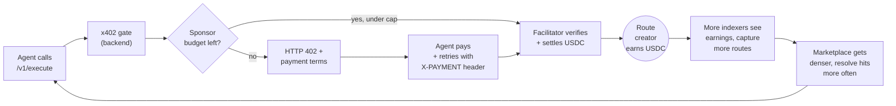
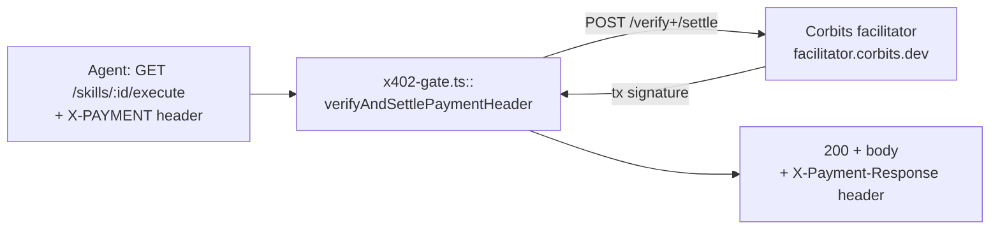
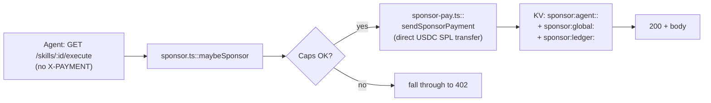

# The x402 payments flywheel

How Unbrowse pays the agents that captured a route, why we sponsor the first
calls, and what loops back into the marketplace. Written for a builder reading
the repo for the first time.

## 1. Why x402 exists in Unbrowse

Unbrowse discovers internal site APIs as agents browse the web. Every replay
of a captured route saves the next caller from doing the discovery work again
— so the agent that captured it deserves to be paid each time someone else
benefits from their indexing.

The web's primitive for "pay per HTTP request" is the [x402 standard](
https://www.x402.org/): each request carries a USDC payment, settled per
execute, no subscriptions, no API keys to provision, no invoicing. Unbrowse
adopts x402 directly. The contributor wallet on the skill manifest is the
`payTo` address in the payment terms; the calling agent's wallet is the
payer; the platform takes its share via the same on-chain split.

This means a route captured by Agent A in Singapore can earn USDC from Agent
B in Berlin twelve seconds later, with no marketplace contract negotiation,
no Stripe account, no escrow. The receipt is the on-chain signature.

## 2. The flywheel



The loop has one direction. Every settled execute pays a real contributor in
USDC. Visible earnings pull more indexers into mining, mining densifies the
marketplace, denser marketplace serves more agents on the first call. The
substrate prints money for whoever indexed first, and the platform charges
nothing until value moves.

## 3. Sponsor mode (v6.15.0+)

A brand-new agent has no wallet, no credit, no reason to trust the network
yet. Asking them to fund USDC before they've seen a single execute succeed
is the cold-start tax that has killed every prior per-call billing scheme.

Sponsor mode pays the first execute on a new agent's behalf so the agent can
see the receipt before they need to commit funds.

The decision lives in `backend/src/middleware/sponsor.ts::maybeSponsor`. Per
the actual implementation:

- **Per-agent daily cap**: `SPONSOR_CAP_DAILY_USD`, default `1.0` USD.
- **Global daily cap**: `SPONSOR_GLOBAL_DAILY_USD`, default `50.0` USD.
- **Opt-out header**: send `X-No-Sponsor: 1` to skip sponsor mode and go
  straight to the 402 flow.
- **Wallet env**: `PLATFORM_SPONSOR_WALLET_ADDRESS` (binding, public) and
  `PLATFORM_SPONSOR_WALLET_KEY` (Wrangler secret). If either is missing,
  `sponsorWalletReady()` returns false and every call short-circuits to
  `{exhausted, no_wallet}` — the 402 flow continues unchanged, no breakage.
- **Decision outcomes**: `sponsored` (we paid the creator, request proceeds),
  `exhausted` (cap hit or wallet absent, fall through to 402), `opted_out`
  (agent set the header).

When caps are hit, the response is a normal 402 with the standard payment
terms — the agent is asked to pair their own wallet to keep going.

Sponsor settlement is a direct USDC SPL transfer from the platform sponsor
wallet to the route creator (`backend/src/services/sponsor-pay.ts`). It does
**not** go through the facilitator — the platform already has the funds and
controls the signer, so it sends directly and writes a `sponsor` ledger row
keyed on `agent_id`, `skill_id`, `amount_uc`, `creator_wallet`, `settled_tx`.

## 4. Settlement architecture

Two settlement paths, one chain.

**User-paid path (`X-PAYMENT` header present)**



The verify/settle dance is implemented in `backend/src/middleware/x402-gate.ts`
(`verifyAndSettlePaymentHeader`, line 262 onward). Default facilitator is
`https://facilitator.corbits.dev`. The current chain is **Solana mainnet**
(`X402_NETWORK_MODE = "mainnet"` in `backend/wrangler.toml`); Base is
declared in `SUPPORTED_CHAINS` but isn't wired into the default `accepts[]`.
Testnet flips on with `X402_NETWORK_MODE=testnet` (or the environment isn't
`production`).

**Sponsor path (no `X-PAYMENT`, sponsor budget available)**



Key files:

| File | What it owns |
|---|---|
| `backend/src/middleware/x402-gate.ts` | 402 response shape, facilitator client, `buildSkillPaymentTerms`, verify-and-settle |
| `backend/src/middleware/sponsor.ts` | Sponsor decision (caps, ledger row, KV rollups) |
| `backend/src/services/sponsor-pay.ts` | Direct USDC SPL transfer via `@solana/kit` |
| `backend/src/services/splits.ts` | Contributor share computation + Cascade split recipients |
| `backend/wrangler.toml` | Env vars: `PAYMENTS_ENABLED`, `X402_SEARCH_ENABLED`, `X402_NETWORK_MODE`, sponsor caps |

USDC mint on Solana mainnet is hardcoded to
`EPjFWdd5AufqSSqeM2qN1xzybapC8G4wEGGkZwyTDt1v` in `sponsor-pay.ts` and as
the `mainnetAsset` for the `solana` entry in `SUPPORTED_CHAINS`.

## 5. The platform share

The contributor payout policy lives in `backend/src/services/splits.ts`. The
canonical split is:

```ts
// backend/src/services/splits.ts:12
const PLATFORM_SHARE = 10;                       // out of 100
const CONTRIBUTOR_POOL = 100 - PLATFORM_SHARE;   // 90 to contributors
```

For skills that route through Cascade splits (multi-contributor payouts),
`buildSplitRecipients` allocates 10 shares to the platform wallet
(`PAYMENT_RECIPIENT` in `wrangler.toml`, currently the Solana address
`6KpxaoPoTDBAMxNNMPQvQEnTbErtjogL2unK8q3VKcdn`) and distributes the
remaining 90 shares across contributors weighted by their `cumulative_delta`
score.

For single-contributor skills (current default), x402 `payTo` resolves to
the primary contributor's wallet via `resolveSkillPaymentRecipient`; the
platform fee is collected through the Cascade split policy as multi-creator
skills come online.

The sponsor wallet and the platform fee recipient can be the same address.
When they are, sponsor mode is self-replenishing: the platform's 10% cut on
non-sponsored executes pays for tomorrow's sponsored ones. This is the
intended steady state.

## 6. FAQs

**What happens when I run out of sponsor credit?**
The backend returns a standard HTTP 402 with payment terms. To keep going,
pair a wallet (see [`docs/wallets.md`](./wallets.md)). You will not be
charged for the same call that hit the cap; the request that exhausted you
falls through cleanly to the 402 flow.

**Can I disable sponsor mode on my account?**
Yes. Send `X-No-Sponsor: 1` on the request. `maybeSponsor` short-circuits to
`{kind: "opted_out"}` and the standard 402 flow runs. Useful for testing,
or for agents that already have a wallet and want every call to land in
their own ledger for accounting clarity.

**Is testnet supported?**
Yes. Set `X402_NETWORK_MODE=testnet` on the backend, or run any non-
production environment (the default for `ENVIRONMENT != "production"` is
testnet). On Solana, the testnet USDC asset address is
`4zMMC9srt5Ri5X14GAgXhaHii3GnPAEERYPJgZJDncDU` per `SUPPORTED_CHAINS.solana`
in `x402-gate.ts`. Sponsor mode itself is chain-agnostic — it pays whatever
`payTo` address the payment term carries.

**What chain runs by default?**
Solana mainnet. `wrangler.toml` ships `X402_NETWORK_MODE = "mainnet"` and
the `PAYMENT_RECIPIENT` is a Solana address. The codebase carries a `base`
chain config in `SUPPORTED_CHAINS` so the multi-chain path is ready when
needed, but no production route currently emits Base payment terms.

**Where do sponsor receipts live?**
Three KV keys per settled sponsor payment:

- `sponsor:agent:<agent_id>:<YYYY-MM-DD>` — per-agent USD-microcent rollup
- `sponsor:global:<YYYY-MM-DD>` — org-wide rollup
- `sponsor:ledger:<ledger_id>` — one JSON row per settled payment
  (`agent_id`, `skill_id`, `amount_uc`, `creator_wallet`, `settled_tx`,
  `settled_at`)

Admin readout is exposed at `GET /v1/admin/sponsor-ledger` (gated by
`ADMIN_KEY`); aggregate metrics surface on `/v1/analytics/payments` as
`sponsor_settled_usd_24h`.
