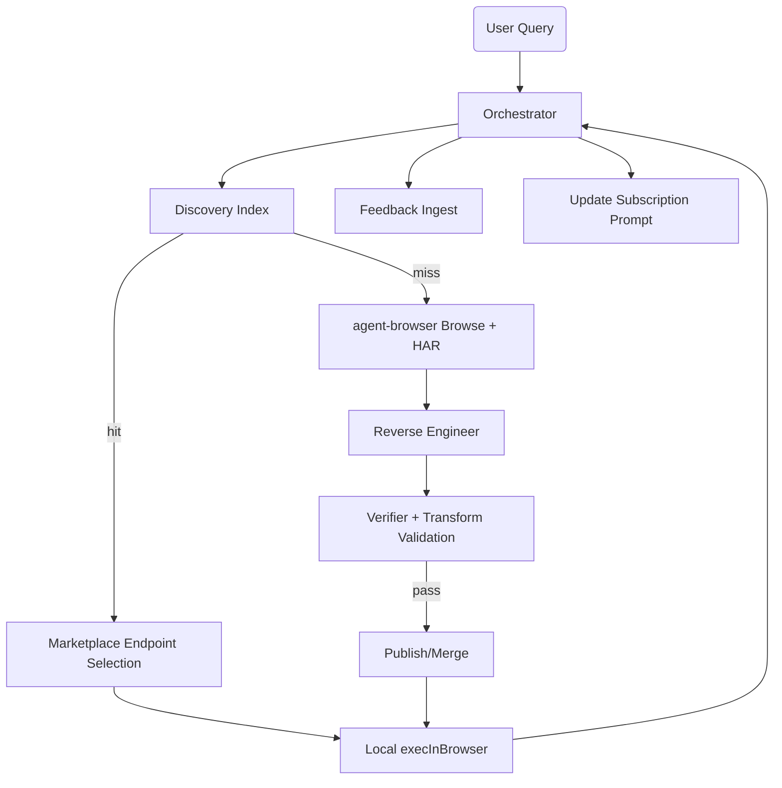

## OpenClaw-as-Agent-Browser Product Spec (v1.0)

## 1) Vision
Build a marketplace-backed, browser-first automation system where users ask intent-level questions and the platform executes reliable HTTP/API calls by replaying browser-authenticated flows captured through `agent-browser` (Vercel), with OpenClaw-like skill learning/reuse, versioned endpoints, validation, and continuous quality feedback.

## 2) Goals and non-goals

### Goals
- Replace OpenClaw plugin capture with `agent-browser` HAR-driven discovery.
- Execute endpoints through browser-context execution (`execInBrowser`) to preserve login, cookies, CSRF, and TLS/browser behavior.
- Learn and publish reusable skills from browsing sessions automatically.
- Route future requests through marketplace discovery with intent matching.
- Add trust/ranking with versioning, schema validation, and transformation layers.
- Add abuse prevention and user feedback loops.
- Add user subscription prompts for skill updates.

### Non-goals (phase 1)
- Full universal anti-bot evasion.
- General-purpose “AI agent with full browser automation replacement”.
- Paid billing flows in initial release.

## 3) Product principles
- Browser parity first: execution must behave like a real browser to pass CSRF/auth checks.
- Marketplace is a catalog and verifier, not the runtime executor.
- Safety by default: mutable actions are explicitly gated.
- Everything executable by intent should be versioned and auditable.
- Reuse is the moat: discovery quality + endpoint density + reliability are core defensibility.

## 4) User story
User asks:
`help me check trends of tesla model y`

Flow:
- system resolves intent in discovery index
- if matching skill exists, executes candidate endpoints locally via `agent-browser execInBrowser`
- if no match, captures live browsing, reverse engineers endpoints, validates, publishes, then executes
- user gets result
- user is optionally asked to subscribe to updates for that skill

## 5) System architecture

## 5.1 Components
- **Query Orchestrator**
  - receives user intent and runtime context
  - calls discovery index and chooses execution plan
- **Discovery Index Service**
  - intent search over skill endpoints and execution history
- **Agent-Browser Capture Service**
  - launches browser sessions
  - captures HAR on browse
- **HAR Reverse-Engineering Service**
  - extracts candidate endpoints and response semantics
  - infers request/response transform requirements
- **Verifier & Test Runner**
  - executes endpoints safely in a controlled harness
  - validates schema + transform correctness + auth integrity
- **Transformation Service**
  - normalizes request/response behavior
- **Marketplace Service**
  - stores skill versions, endpoint metadata, verification proofs
  - deduplicates and merges endpoint variants
- **Execution Service**
  - local runtime using `agent-browser chrome execInBrowser`
- **Abuse Control Service**
  - rate limiting, anomaly checks, mutation protection
- **Feedback Service**
  - accepts skill/plugin execution feedback and updates reliability scores
- **Subscription Service**
  - manages user update opt-ins and notification preferences

## 5.2 Canonical control flow
`intent -> discovery -> cache/match -> local execute via execInBrowser -> publish/merge if newly discovered -> return result -> collect feedback/subscription signal`

## 5.3 Diagram

## 6) Discovery Index layer
- **Purpose:** avoid unnecessary live browsing and maximize reuse.
- **Index inputs:** intent signature, domain hints, user locale, source, past failures/successes.
- **Signals:**
  - semantic intent similarity
  - method/type compatibility
  - reliability score
  - freshness score
  - user feedback score
  - abuse risk score
- **Ranking policy:**
  - Exact intent template matches rank highest
  - Then semantic similarity
  - Then same domain/subdomain matches
  - Then cold-start fallback to live capture
- **Storage:** vector index + inverted text index + structured metadata DB.
- **Response contract:**
  - top N candidates
  - confidence score
  - predicted risk (safe/needs_confirmation)

## 7) Discovery, versioning, and publish lifecycle

## 7.1 Versioning model
- **Version format:** SemVer string and immutable monotonic build id (`major.minor.patch`, plus `build_sha`).
- **Rules:**
  - `major`: schema contract or auth model changed non-compatibly
  - `minor`: new endpoint added, safe compatibility extension
  - `patch`: tuning, reliability score, transform rules, retry policy updates
- **Metadata on every publish:**
  - `created_at`, `created_by`, `prev_version`, `changelog`
  - `schema_version`, `transform_version`, `verification_hash`
- **Rollback:** explicit endpoint to rollback target version with evidence trail.

## 7.2 Duplicate / merge policy
- Compare normalized endpoint signatures:
  - method, normalized URL template, auth profile, response canonical schema, CSRF strategy
- Merge candidate into canonical `skill.subdomain` or `service` bucket.
- Merge outcome includes:
  - new canonical id
  - alias ids
  - provenance references
  - confidence delta
- Do not delete old versions, only deprecate or supersede.

## 8) Skill schema validation
- Validate at ingest and publish time.
- Hard failures block publish.
- Soft failures emit warnings and continue with lower trust score.

## 8.1 Skill manifest schema (logical)
Fields:
- `skill_id`
- `version`
- `schema_version`
- `name`
- `intent_signature`
- `domain`
- `subdomain`
- `description`
- `owner_type` (`agent`, `marketplace`, `user`)
- `endpoints[]`
- `auth_profile`
- `transform`
- `verification`
- `lifecycle` (`active`, `deprecated`, `suspended`)

## 8.2 Endpoint descriptor schema (logical)
Fields:
- `endpoint_id`
- `method`
- `url_template`
- `headers_template`
- `query`
- `body`
- `csrf_plan`
- `oauth_plan`
- `transform`
- `idempotency` (`safe` / `unsafe`)
- `verification_status`
- `reliability_score`
- `last_verified_at`
- `signature`

## 8.3 Validation checks
- URL template must be normalized and deterministic.
- `idempotency` required for all non-GET methods.
- OAuth and CSRF plan required for endpoints that return auth-required verification signatures.
- Transform expressions must parse and execute deterministically.
- Response schema shape must be machine-checkable.

## 9) Transformation layer
- Purpose: stabilize volatile endpoints and normalize outputs across sessions/sites.
- Transform types:
  - request path/query/body normalization
  - header canonicalization
  - response shape normalization
  - pagination and time-window normalization
  - error code normalization
  - units/date formatting normalization

## 9.1 Example transform stages
- Request transform:
  - enforce timezone headers
  - sort query keys
  - sanitize dynamic parameters
- Response transform:
  - flatten arrays to table objects
  - coerce numeric strings to numbers
  - map known error formats to canonical schema
  - strip ephemeral IDs from cache keys
- Transform versioning:
  - versioned independently from endpoint code
  - tied to skill version lineage

## 10) Execution model
- Runtime executes using `agent-browser` browser context, not raw HTTP fetch only.
- Steps:
  - initialize browser profile/session
  - hydrate auth state
  - apply CSRF injection strategy
  - execute endpoint via `execInBrowser`
  - capture fresh execution trace
  - apply transforms
  - return normalized result + trace id
- Non-replayable safety:
  - `GET` allowed when confidence high
  - mutable verbs require explicit confirmation and safety flags

## 11) Abuse prevention
- **Rate limiting**
  - per-user per-domain request rate
  - per-skill burst limits
- **Replay/automation controls**
  - repeated identical high-risk requests detection
  - mutation endpoint throttling
- **Anomaly detection**
  - impossible login cadence
  - rapid IP/profile churn
  - unusual session token reuse patterns
- **Security escalation**
  - soft block, then hard block
  - CAPTCHAs/challenges for borderline patterns
  - review queue for repeated abuse signals

## 12) Feedback tool
- Collect feedback for:
  - skill execution
  - endpoint execution
  - plugin execution quality
- API:
  - `POST /api/feedback`
  - payload:
    - `target_type` (`skill`, `endpoint`, `plugin_execution`)
    - `target_id`
    - `execution_trace_id`
    - `outcome` (`success`, `partial`, `failed`)
    - `rating` (1-5)
    - `notes` (optional)
    - `issues` (`auth`, `csrf`, `accuracy`, `stale_data`, `speed`, `other`)
    - `metadata` (optional tags)
- Feedback effects:
  - quality score update
  - ranking adjustment in discovery index
  - revalidation job trigger for low scores
  - possible de-prioritization in intent matching

## 13) Subscription prompt flow
- Trigger:
  - successful execution
  - successful onboarding of newly learned skill
  - major version or schema update
- Prompt text pattern:
  - “Want updates when this skill changes?”
- Subscription options:
  - in-app
  - email
  - webhook
- Notify-on events:
  - new version
  - verification state change
  - reliability score degradation
  - auth flow changes
- Data:
  - `user_id`, `skill_id`, `notify_channel`, `notify_rules`, `created_at`, `status`

## 14) Auth lifecycle and CSRF memory
- Persist per skill/endpoint:
  - oauth grant type and flow
  - token source and expiry strategy
  - csrf source (cookie/header/form)
  - csrf parameter location and refresh policy
- Recovery:
  - token stale -> refresh path
  - csrf failure -> retry with alternate extractor sequence
  - hard fail -> user prompt + reauth queue
- Secrets handling:
  - store encrypted credentials only
  - never persist raw CSRF tokens in skill definition output

## 15) Marketplace reliability/verification model
- Verification outputs:
  - execution proof
  - transformed output hash
  - auth replayability marker
  - confidence score
- Trust score components:
  - verification pass ratio
  - feedback trend
  - freshness
  - abuse incidents
- Marketplace acts as:
  - trust registry
  - route planner
  - de-duplication authority
- Execution still local: runtime calls remain in user environment for browser-level fidelity.

## 16) API contracts

## 16.1 Intent resolution
`POST /v1/intent/resolve`
- Input: user text, context, user id
- Output: ranked candidates + selected execution plan

## 16.2 Skill publish
`POST /v1/skills`
- Input: manifest + endpoints + transforms + validation artifacts
- Output: versioned published skill id

## 16.3 Skill execute
`POST /v1/skills/{skill_id}/execute`
- Input: `skill_version`, params, session context
- Output: transformed result + trace id + confidence + safety metadata

## 16.4 Feedback
`POST /v1/feedback`
- Captures outcome and optional issue tags

## 16.5 Subscribe
`POST /v1/skills/{skill_id}/subscribe`
- Manage user preference and notification rules

## 17) Data model (logical entities)
- User
- Skill
- SkillVersion
- Endpoint
- EndpointVersion
- Transform
- AuthProfile
- ExecutionTrace
- VerificationRun
- Feedback
- AbuseSignal
- Subscription
- DiscoveryCandidate

## 18) Metrics
- Median intent-to-result latency
- Discovery hit rate
- Publish pass rate (capture -> verify -> publish)
- Execution success rate by skill and endpoint
- Mutable execution rejection rate
- Abuse incident rate by domain and user
- Feedback median score and trend
- Subdomain endpoint growth
- Update adoption rate among subscribed users

## 19) KPIs for moat
- Indexed endpoints by subdomain
- Repeat-use ratio of learned skills
- Time-to-first-match on common intents
- Reduction in cold-start captures over time
- User trust score from feedback

## 20) Reliability and failover
- If discovery index is down:
  - degrade to marketplace last-known cache
- If verification service is unavailable:
  - execute with warning mode only for pre-verified cached items
- If execution fails:
  - return trace + suggested remediation
  - open feedback path with issue preset defaults
- If duplicate merge conflict:
  - keep both versions, mark one pending review

## 21) Security and compliance
- Encrypt tokens at rest and in transit
- Enforce least-privilege execution profiles
- Audit logs for publish, reverts, and abuse interventions
- PII minimization in traces and logs
- Retain traces per policy with user-facing deletion rights

## 22) Delivery phases

## Phase 1 (MVP)
- agent-browser capture
- reverse engineer + skill publish
- local execInBrowser
- schema validation + versioning
- basic discovery index by intent/domain
- feedback tool

## Phase 2
- transformation engine
- duplication merging
- subscription flow
- robust abuse prevention
- safety gating for mutable endpoints

## Phase 3
- marketplace trust scoring
- advanced CSRF/OAuth inference
- webhook notifications
- large-scale vector index optimization
- public SDK for skill authors/consumers

## 23) Acceptance criteria (minimum)
- 95% of successful replayable intents served from marketplace after 14 days
- 0 critical schema violations on publish
- < 2s median index lookup for cached intents
- >90% correct `GET` execution against previously verified endpoints
- Explicit confirmation required before any mutable non-idempotent action
- Feedback submitted for >20% of failed executions with retry suggestion
- Subscribed users receive version update notifications within 60s

## 24) Open questions
- Whether to support cross-browser parity targets beyond Chrome initially
- How aggressive duplicate merge policy should be for fuzzy endpoint variants
- Whether to auto-escalate CAPTCHAs to manual review vs user-assisted solve
- How public vs private skill visibility should evolve after launch